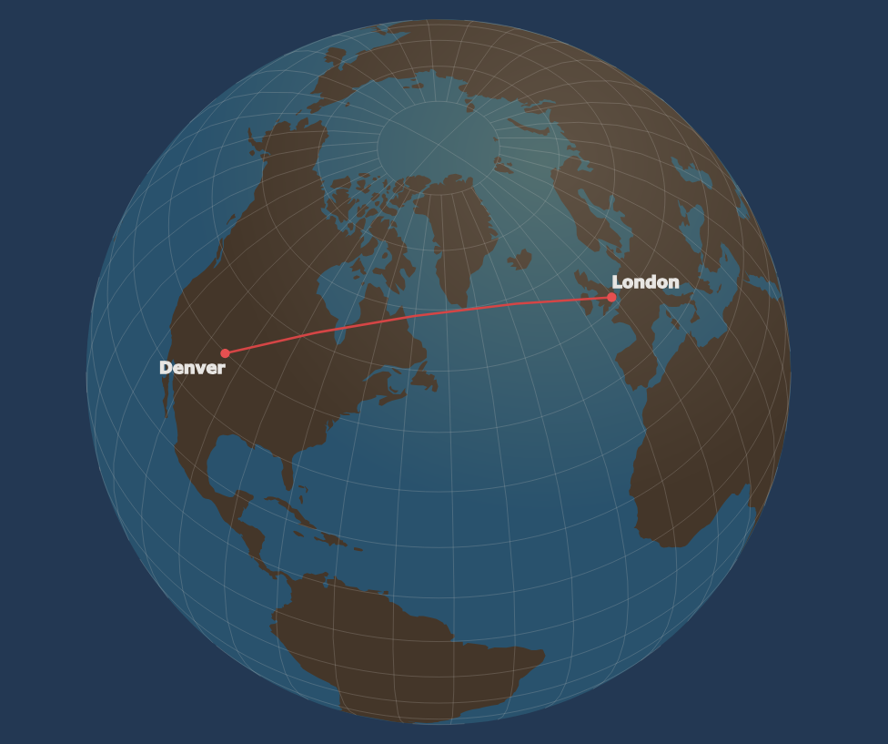

# Great Circle Cookbook

[](https://github.com/ProjectPythia/cookbook-template/actions/workflows/nightly-build.yaml)
[](https://binder.projectpythia.org/v2/gh/ProjectPythia/cookbook-template/main?labpath=notebooks)
[](https://zenodo.org/badge/latestdoi/475509405)

This Project Pythia Cookbook covers the mathematics of working with Great Circles

## Motivation

A great circle is the largest circle that can be drawn onto a sphere (like the Earth) that is the same diameter of the sphere. Great Circle arcs connect two positions on the curved surface of a planet like Earth and are commonly used for navigation that relies on "as-the crow flies" directions like planes, ships, and satellites

<p align="center">

</p>

_Image Source: [Wolfram MathWorld](https://mathworld.wolfram.com/GreatCircle.html)_

## Authors

[Cora Schneck](https://github.com/cyschneck)

### Contributors

<a href="https://github.com/ProjectPythia/great-circle-cookbook/graphs/contributors">
  
</a>

## Structure

This cookbook is broken into two main sections:
- Foundations and Terminology
- Working with Great Circles

Where available, this cookbook will demonstrate how to determine the features of a great circle with both existing open-source Python packages and through spherical trigonometry and mathematics

### Foundations and Terminology

- "Great Circle Terminology": Breakdown of terminology important for working with and understanding great circles including WGS-84
- "Coordinate Systems": Understanding and converted to different types of coordinate systems like Cartesian, Spherical, Polar, and Geodesic (Latitude/Longitude)

Each section will make use of plotting to visually demonstrate concepts with `matplotlib` and `cartopy`

### Working with Great Circles

1. **Great Circle Arcs and Paths**
- Generating a great circle arc and path
- Midpoint (and additional intermediate points) of a great circle arc
- Length of a great circle arc (the distance between two points)
- Spherical distance to degrees
- Bearing of a great circle arc
- Compare great circle arc to rhumb line
- Antipodal point

2. **Great Circles and a Point**
- Determine the distance of a point to a great circle arc
- Determine the distance of a point to a great circle path
- Determine if a point lies on a great circle arc and path (with and without tolerances)

3. **Great Circles and Parallels**
- Determine the maximum and minimum latitude coordinates along a great circle path
- Determine when a great circle path crosses parallels

4. **Intersections of Great Circles**
- Find the intersection of two great circle paths (always exists)
- Find the intersection of two great circle arcs (if it exists)

5. **Angles and Great Circles**
- Calculate the acute and obtuse angle of two great circle paths
- Calculate the directed angle of two great circle paths based on an intersection point
- Working with Spherical Triangles formed by great circle arcs

6. **Spherical Polygons and Areas**
- Determine clockwise/counterclockwise ordering of points on spherical polygon
- Area and Permieter of quadrilateral patch on a unit sphere
- Determine if a given point is within a spherical polygon
- Mean center of spherical polygon

7. **Indiana Jones and the Great Circle**
- Working Example

## Running the Notebooks

You can either run the notebook using [Binder](https://binder.projectpythia.org/) or on your local machine.

### Running on Binder

The simplest way to interact with a Jupyter Notebook is through
[Binder](https://binder.projectpythia.org/), which enables the execution of a
[Jupyter Book](https://jupyterbook.org) in the cloud. The details of how this works are not
important for now. All you need to know is how to launch a Pythia
Cookbooks chapter via Binder. Simply navigate your mouse to
the top right corner of the book chapter you are viewing and click
on the rocket ship icon, (see figure below), and be sure to select
“launch Binder”. After a moment you should be presented with a
notebook that you can interact with. I.e. you’ll be able to execute
and even change the example programs. You’ll see that the code cells
have no output at first, until you execute them by pressing
{kbd}`Shift`\+{kbd}`Enter`. Complete details on how to interact with
a live Jupyter notebook are described in [Getting Started with
Jupyter](https://foundations.projectpythia.org/foundations/getting-started-jupyter.html).

### Running on Your Own Machine

If you are interested in running this material locally on your computer, you will need to follow this workflow:

1. Clone the `https://github.com/ProjectPythia/great-circle-cookbook` repository:

   ```bash
    git clone https://github.com/ProjectPythia/great-circle-cookbook.git
   ```

1. Move into the `great-circle-cookbook` directory
   ```bash
   cd great-circle-cookbook
   ```
1. Create and activate your conda environment from the `environment.yml` file
   ```bash
   conda env create -f environment.yml
   conda activate cookbook-gc
   ```
1. Move into the `notebooks` directory and start up Jupyterlab
   ```bash
   cd notebooks/
   jupyter lab
   ```
